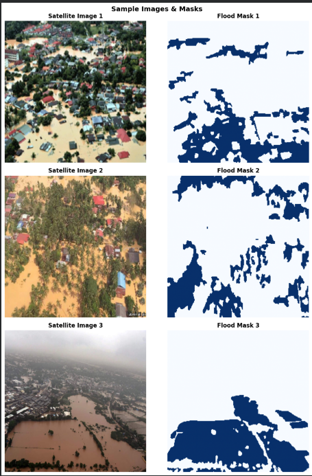
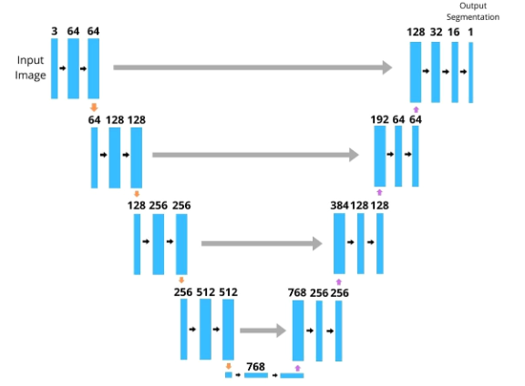
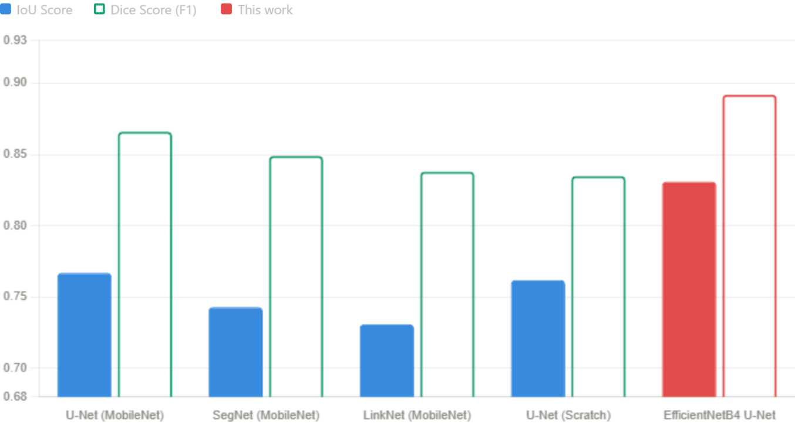
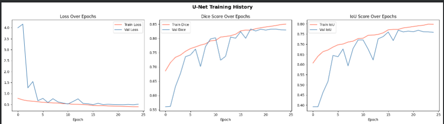
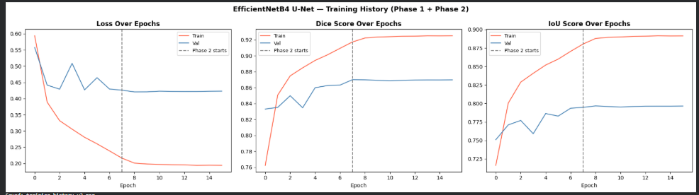
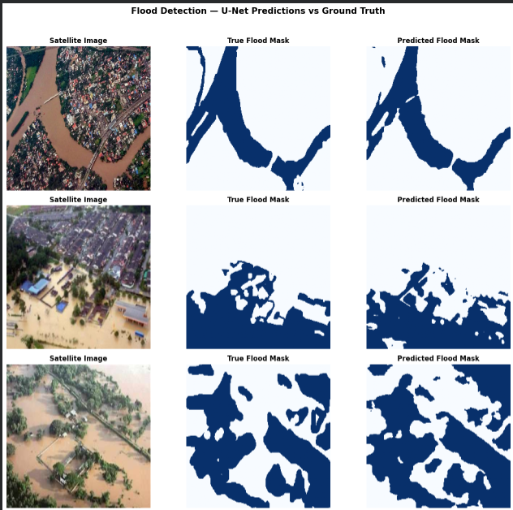
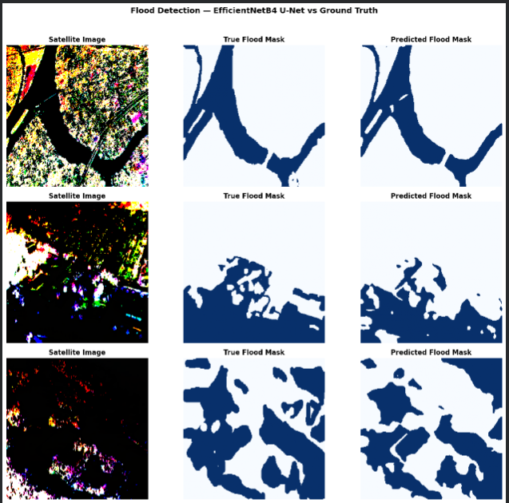
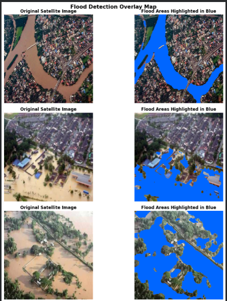
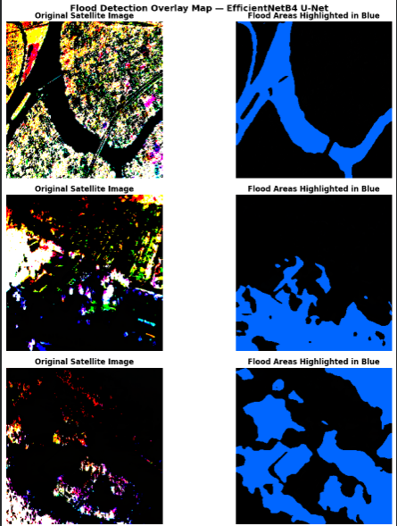

# 🌊 Flood Detection from Satellite Imagery

Pixel-level flood segmentation from aerial/satellite imagery using **U-Net**, progressed from a scratch-built encoder to a **U-Net + EfficientNetB4** transfer-learning architecture.

Built for **Deep Learning (Computer Vision)**.

---

## 📌 Overview

Floods account for roughly 40% of all natural disasters worldwide, and rapid, accurate flood mapping is critical for disaster response. This project builds an automated, pixel-level flood detection system in two progressive stages:

1. **Stage 1 — Scratch U-Net**: A U-Net segmentation model built entirely from scratch in TensorFlow/Keras. Solved a real overfitting problem (caused by only 290 training images) using a 4x data augmentation pipeline.
2. **Stage 2 — U-Net + EfficientNetB4 (Transfer Learning)**: Replaced the scratch encoder with an ImageNet-pretrained EfficientNetB4 backbone, trained with a two-phase (frozen → fine-tune) strategy for stronger performance.

Both models are benchmarked against **Soebroto et al. (2025)**, who reported a best IoU of 0.767 on the same dataset using U-Net + MobileNet.

## 🗂️ Dataset

- **Flood Area Segmentation dataset** — 290 aerial RGB images with binary flood masks
- Roughly 40.7% flood pixels (mild class imbalance)
- Split: 80% train / 10% val / 10% test (with 4x augmentation applied to training set only)

<p align="center">
  
</p>
<p align="center"><em>Sample satellite images (left) and their corresponding ground-truth flood masks (right).</em></p>

## 🏗️ Architecture

**Stage 1 — Scratch U-Net**

- Classic encoder–decoder with skip connections, built from scratch
- Trained on 0–1 normalized images
- Loss: combined Binary Cross-Entropy + Dice Loss

<p align="center">
  
</p>
<p align="center"><em>U-Net encoder–decoder architecture with skip connections.</em></p>

**Stage 2 — U-Net + EfficientNetB4**

- ImageNet-pretrained EfficientNetB4 encoder (via `segmentation-models`) + U-Net decoder
- Images kept in 0–255 range, normalized using EfficientNet's own preprocessing function (applied *after* augmentation)
- **Phase 1**: backbone frozen, decoder trained for 8 epochs (LR = 1e-3)
- **Phase 2**: full network fine-tuned for up to 30 epochs (LR = 1e-5)

## 📊 Results

| Model                                                  | Dice Score | IoU Score                  |
| ------------------------------------------------------ | ---------- | -------------------------- |
| Scratch U-Net (no augmentation)                        | —          | 0.409 (val, early-stopped) |
| Scratch U-Net (with 4x augmentation)                   | 0.835      | 0.762                      |
| **U-Net + EfficientNetB4 (2-phase transfer learning)** | **0.892**  | **0.831**                  |
| Soebroto et al. (2025) — U-Net + MobileNet (benchmark) | 0.866 (F1) | 0.767                      |

**Improvement over scratch U-Net:** Dice 0.835 → 0.892 (+5.7%), IoU 0.762 → 0.831 (+6.9%)
> Final test set: Dice Score 0.8920, IoU Score 0.8306, Test Loss 0.3207 — trained on 832 augmented samples (4x) from the original 290-image dataset, using a two-phase (frozen backbone → fine-tune) strategy with an ImageNet-pretrained EfficientNetB4 backbone.

<p align="center">
  
</p>
<p align="center"><em>IoU comparison: Soebroto et al. architectures vs. Stage 1 scratch U-Net vs. Stage 2 EfficientNetB4.</em></p>

### Training History

<p align="center">
  
  <br/>
  <em>Stage 1 (Scratch U-Net) — Loss, Dice, and IoU over 25 epochs.</em>
</p>

<p align="center">
  
  <br/>
  <em>Stage 2 (EfficientNetB4) — combined Phase 1 (frozen) + Phase 2 (fine-tune) training curves.</em>
</p>

### Visual Predictions

<p align="center">
  
  
</p>
<p align="center"><em>Satellite image | true mask | predicted mask — Stage 1 (left) vs. Stage 2 (right). Stage 2 shows sharper boundary precision.</em></p>

<p align="center">
  
  
</p>
<p align="center"><em>Flood overlay maps — Stage 1 (left) vs. Stage 2 (right), with flood zones highlighted in blue.</em></p>

## 🧰 Tech Stack

- Python 3, TensorFlow / Keras
- `segmentation-models` (EfficientNetB4 backbone + preprocessing)
- OpenCV, NumPy, scikit-learn, Matplotlib

## ⚙️ Setup

1. **Clone the repo**

```
git clone https://github.com/<your-username>/flood-detection.git
cd flood-detection
```

2. **Install dependencies**

```
pip install -r requirements.txt
```

3. **Get the dataset** The notebooks expect a folder structure like:

```
data/
├── Image/   # satellite/aerial RGB images
└── Mask/    # corresponding binary flood masks
```

Download the *Flood Area Segmentation* dataset (e.g. from Kaggle) and place it under `data/`.

4. **Update paths** The notebooks were originally written for Google Colab and mount Google Drive with paths like:

```
IMAGE_PATH = '/content/drive/MyDrive/flood_detection/data/Image/'
MASK_PATH  = '/content/drive/MyDrive/flood_detection/data/Mask/'
```

If running locally or on a different platform, update these paths (and remove/skip the `drive.mount(...)` cell) to point at your local `data/` folder.

5. **Run the notebooks in order**

- `notebooks/01_scratch_unet.ipynb` — trains and evaluates the scratch U-Net baseline
- `notebooks/02_efficientnetb4_unet.ipynb` — trains and evaluates the EfficientNetB4 transfer-learning model

## 🔭 Future Work

- Incorporate larger, more diverse datasets (e.g. Sen1Floods11, Copernicus Emergency Management imagery, NASA Earth Observatory data)
- Use SAR imagery instead of RGB for cloud-penetrating, day/night flood mapping
- Move from binary segmentation to flood depth/severity estimation
- Evaluate cross-dataset generalization

## 📚 Key References

- Ronneberger et al. (2015) — U-Net: Convolutional Networks for Biomedical Image Segmentation
- Tan & Le (2019) — EfficientNet: Rethinking Model Scaling for CNNs
- Soebroto et al. (2025) — Comparative study of U-Net/SegNet/LinkNet backbones on the Flood Area Segmentation dataset (primary benchmark used in this project)

## 📄 Report

Full reference list and complete project report available on request.
Contact: aafiaazhar0@gmail.com

## 📜 License

This project is licensed under the MIT License — see [`LICENSE`](https://github.com/aafia1/FLOOD-DETECTION-FROM-SATELLITE-IMAGERY/blob/main/LICENSE) for details.
